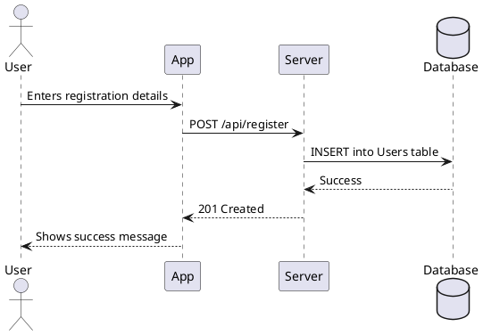

# Sequence Diagram

## User Registration



## Crop Health Diagnostics

```plantuml
@startuml
actor Farmer
participant App
participant Server
participant AI_Service

Farmer -> App: Uploads crop image
App -> Server: POST /api/diagnose
Server -> AI_Service: POST /diagnose
AI_Service --> Server: Returns diagnosis
Server -> App: Returns diagnosis
App -> Farmer: Displays diagnosis and recommendations
@enduml
