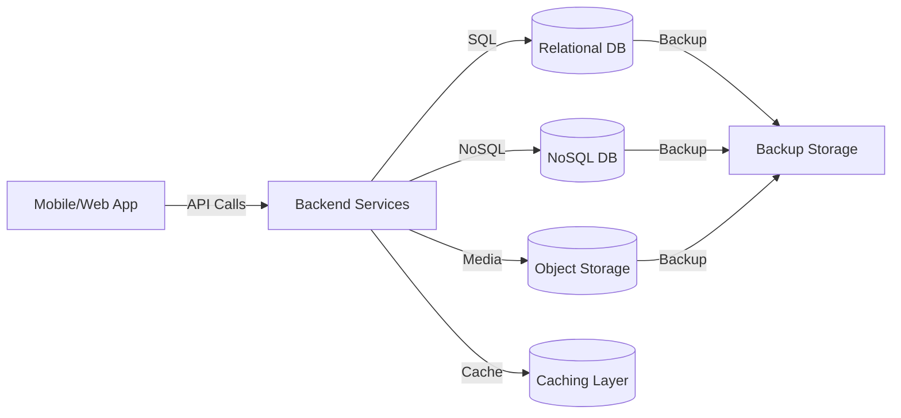

# HLD: Data Storage Architecture

## Overview
Data storage is split across multiple specialized systems for scalability, performance, and flexibility. This ensures reliable, secure, and efficient management of all types of data generated by the platform.

## Storage Layers
- **Relational DB:**
  - Stores structured data such as user profiles, transactions, logs, and configuration.
  - Enforces referential integrity and supports ACID transactions.
  - Example: PostgreSQL, MySQL.
- **NoSQL DB:**
  - Manages unstructured or semi-structured data such as forum posts, chat messages, and activity feeds.
  - Supports flexible schemas and horizontal scaling.
  - Example: MongoDB, DynamoDB.
- **Object Storage:**
  - Used for storing large binary objects like images, documents, and media files.
  - Provides high durability, redundancy, and cost-effective storage.
  - Example: AWS S3, Azure Blob Storage.
- **Caching:**
  - In-memory data store for frequently accessed data such as sessions, configuration, and hot content.
  - Reduces latency and improves app responsiveness.
  - Example: Redis, Memcached.

## Data Flow Diagram


## Data Storage C4 Context Diagram

Below is a Mermaid-based C4 Context Diagram showing how platform actors and services interact with the data storage systems.

```mermaid
%% C4 Context Diagram for Data Storage
C4Context
    Person(user, "Farmer/User", "Uses the platform")
    Person(admin, "Admin", "Manages data and compliance")
    System(system, "Kheti Sahayak Platform", "Core business logic and APIs")
    System_Ext(backup, "Backup Service", "Offsite/Cloud backups")
    System_Ext(audit, "Audit System", "Monitors data access and integrity")

    user -> system : Uses services (APIs)
    admin -> system : Administers data (RBAC)
    system -> backup : Triggers backups
    system -> audit : Sends logs/alerts
```

---

## Data Storage C4 Container Diagram

This diagram illustrates the main containers involved in data storage, backup, and integrity within the platform.

```mermaid
%% C4 Container Diagram for Data Storage
C4Container
    System_Boundary(system, "Kheti Sahayak Platform") {
        Container(api, "API Gateway", "Kong/Nginx", "Routes data requests")
        Container(data, "Relational DB", "PostgreSQL/MySQL", "Structured, transactional data")
        Container(nosql, "NoSQL DB", "MongoDB/DynamoDB", "Unstructured data, documents")
        Container(obj, "Object Storage", "S3/Blob", "Images, files, media")
        Container(cache, "Cache", "Redis/Memcached", "Performance optimization")
        Container(backup, "Backup Service", "Cloud/Local", "Automated, encrypted backups")
        Container(audit, "Audit & Monitoring", "ELK Stack", "Logs, data integrity checks")
    }
    Person(admin, "Admin")

    api -> data : CRUD operations
    api -> nosql : Unstructured data ops
    api -> obj : File/media uploads
    api -> cache : Reads/writes cache
    data -> backup : Backup jobs
    data -> audit : Audit logs
    admin -> backup : Reviews backups
    admin -> audit : Reviews logs
```

---

## Data Management
- **Backups & Disaster Recovery:**
  - Automated, regular backups for all storage systems.
  - Offsite and encrypted backup storage.
  - Periodic restore drills to verify recoverability.
- **Data Retention & Archival:**
  - Policies for retaining and archiving historical data.
  - Automated purging of obsolete or expired records.
- **Access Controls & Encryption:**
  - Role-based access to storage systems.
  - Encryption at rest and in transit.
  - Audit logging of all data access and changes.
- **Data Integrity:**
  - Checksums, validation, and regular consistency checks.
- **Compliance:**
  - Adherence to data residency and regulatory requirements.
