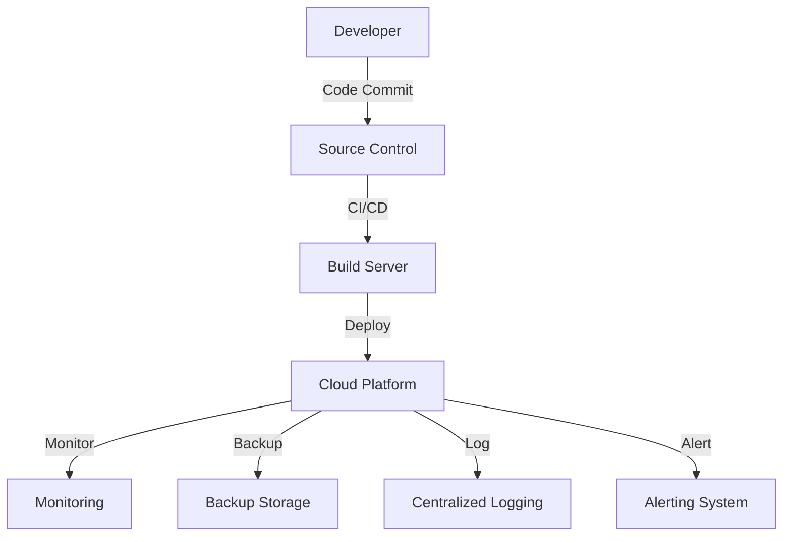

# HLD: DevOps & Deployment

## Overview
Modern DevOps practices ensure reliability, scalability, and rapid iteration. The platform is built for automated, safe, and observable operations.

## CI/CD Pipeline
- **Source Control:** All code managed in Git with branching strategy (e.g., GitFlow).
- **Automated Testing:** Unit, integration, and security tests on every commit.
- **Build Automation:** Docker images, dependency scanning, and reproducible builds.
- **Deployment Automation:** Staged deployments (dev, staging, prod), blue/green and canary releases.
- **Rollback Mechanisms:** Automated rollback on failure, database migrations with versioning.

## Monitoring & Logging
- **APM:** Application Performance Monitoring (e.g., New Relic, Datadog).
- **Centralized Logging:** Aggregation, search, and alerting (e.g., ELK, CloudWatch).
- **Error Tracking:** Real-time error reporting and alerting.
- **User Analytics:** Usage metrics, feature adoption, and retention analysis.

## Backup & Recovery
- **Scheduled Backups:** Automated, encrypted, and offsite.
- **Disaster Recovery:** Regular drills, documented runbooks, and RTO/RPO targets.
- **Data Integrity:** Verification and periodic restore tests.

## Deployment Diagram


## DevOps & Deployment C4 Container Diagram

Below is a Mermaid-based C4 Container Diagram illustrating the CI/CD pipeline, monitoring, and deployment infrastructure for the Kheti Sahayak platform.

```mermaid
%% C4 Container Diagram for DevOps & Deployment
C4Container
    System_Boundary(devops, "DevOps & Deployment") {
        Container(ci, "CI/CD Pipeline", "GitHub Actions/Jenkins", "Build, test, deploy automation")
        Container(registry, "Artifact Registry", "Docker Hub/ECR", "Stores container images")
        Container(k8s, "Kubernetes Cluster", "EKS/AKS/GKE", "Orchestrates microservices")
        Container(monitor, "Monitoring & Alerting", "Prometheus/Grafana", "Metrics, dashboards, alerts")
        Container(log, "Centralized Logging", "ELK Stack/CloudWatch", "Aggregates logs & events")
        Container(backup, "Backup & Restore", "Cloud/On-prem", "Automated backups, recovery")
    }
    System_Ext(repo, "Source Code Repository", "GitHub/GitLab")
    System_Ext(dev, "Developer", "Commits code, triggers CI")
    System_Ext(admin, "Admin/DevOps", "Manages deployments, monitors health")

    dev -> repo : Pushes code
    repo -> ci : Triggers pipeline
    ci -> registry : Pushes images
    ci -> k8s : Deploys services
    k8s -> monitor : Exposes metrics
    k8s -> log : Streams logs
    k8s -> backup : Triggers backups
    admin -> monitor : Views dashboards
    admin -> log : Reviews logs
    admin -> backup : Manages backups
```

## Reliability
- **Auto-scaling:** Horizontal and vertical scaling based on load.
- **Load Balancing:** Global and regional load balancers.
- **Zero-Downtime Deployments:** Rolling updates and health checks.
- **Security:** Secrets management, vulnerability scanning, and least-privilege IAM roles.
- **Documentation:** Runbooks, architecture diagrams, and knowledge base for operations.
