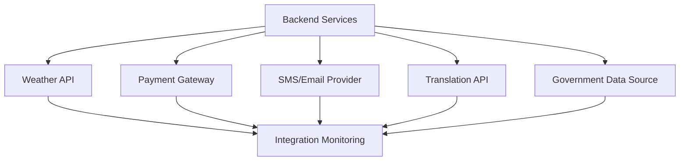

# HLD: Integration Points

## Overview
The platform integrates with several external services to provide core functionality. Each integration is secured, monitored, and designed for resilience.

## Major Integrations
- **Weather APIs:**
  - Real-time and forecast weather data from trusted providers.
  - Data normalization and caching for consistent user experience.
- **Payment Gateways:**
  - UPI, cards, wallets for seamless and secure transactions.
  - PCI DSS compliance and fraud detection mechanisms.
- **SMS/Email Providers:**
  - OTP for authentication, alerts, and notifications.
  - Fallback to alternate channels if delivery fails.
- **Translation APIs:**
  - Dynamic translation of static and user-generated content.
  - Support for major Indian languages and right-to-left scripts.
- **Government Data:**
  - Automated retrieval of schemes, advisories, and eligibility checks.
  - Verification of authenticity and periodic refresh.

## Integration Diagram


## Integration Points C4 Context Diagram

Below is a Mermaid-based C4 Context Diagram highlighting the major external integrations and their security boundaries for the Kheti Sahayak platform.

```mermaid
%% C4 Context Diagram for Integration Points
C4Context
    Person(user, "Farmer/User", "Uses platform features")
    System(platform, "Kheti Sahayak Platform", "Core business logic and APIs")
    System_Ext(weather, "Weather API", "Provides weather data")
    System_Ext(payment, "Payment Gateway", "Handles transactions")
    System_Ext(notification, "Notification Provider", "Sends SMS/Email/Push")
    System_Ext(translation, "Translation API", "Multilingual support")
    System_Ext(gov, "Government Data", "Schemes and advisories")

    user -> platform : Uses services (HTTPS)
    platform -> weather : Fetches weather data (API Key, TLS)
    platform -> payment : Processes payments (PCI DSS, TLS)
    platform -> notification : Sends notifications (TLS, Rate Limiting)
    platform -> translation : Requests translations (API Key, HTTPS)
    platform -> gov : Fetches government data (Secure API)
```

## Security & Reliability
- **API Keys & Secrets:** Secure storage and rotation using KMS.
- **Monitoring:** Real-time monitoring of integration health and performance.
- **Fallbacks:** Graceful degradation and retries for critical integrations.
- **Compliance:** Adherence to data protection and financial regulations.
- **Audit:** Logging of all third-party interactions and failures.
