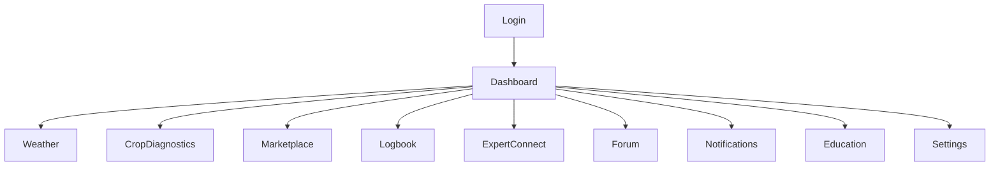

# HLD: Mobile App Frontend

## Overview
The mobile app is the primary user interface for farmers, experts, and vendors. It is designed for intuitive navigation, accessibility, and multilingual support. The app is optimized for low-end devices and intermittent connectivity.

## Main Modules
- **Authentication & Profile Management:** Secure login, registration, and user profile editing.
- **Dashboard:** Personalized overview with weather, market, and activity highlights.
- **Weather Forecast:** Localized, real-time, and forecast weather data with visualizations.
- **Crop Diagnostics:** AI-powered photo upload, disease/pest detection, and recommendations.
- **Marketplace:** Buy/sell crops, equipment, labor, with integrated payments.
- **Digital Logbook:** Record-keeping for farm activities, expenses, and yields.
- **Expert Connect:** Chat, video calls, webinars, and expert Q&A.
- **Community Forum:** Peer-to-peer discussions, posts, and ratings.
- **Notifications:** Push/in-app alerts for weather, market, and community updates.
- **Educational Content:** Tutorials, guides, videos, and government schemes.
- **Settings:** Language, accessibility, and personalization.

## UI/UX Flow (Sample)


## Mobile App C4 Context Diagram

Below is a Mermaid-based C4 Context Diagram showing the main actors and systems interacting with the Kheti Sahayak mobile app.

```mermaid
%% C4 Context Diagram for Mobile App
C4Context
    Person(user, "Farmer/User", "Uses the mobile app")
    Person(admin, "Admin", "Manages content and support")
    System(app, "Kheti Sahayak Mobile App", "Android/iOS app for farmers")
    System_Ext(backend, "Backend Services", "APIs, business logic, data storage")
    System_Ext(notification, "Notification Provider", "Push/SMS/Email notifications")

    user -> app : Uses app (Biometric/OTP login)
    admin -> backend : Admin APIs
    app -> backend : API calls (HTTPS)
    backend -> notification : Sends notifications
```

---

## Mobile App C4 Container Diagram

This diagram illustrates the main containers within the mobile app and its interactions with backend services.

```mermaid
%% C4 Container Diagram for Mobile App
C4Container
    System_Boundary(app, "Kheti Sahayak Mobile App") {
        Container(ui, "UI Layer", "Flutter/React Native", "User interface, navigation")
        Container(auth, "Auth Module", "Local/Backend", "Biometric, OTP, OAuth2")
        Container(storage, "Local Storage", "SQLite/Secure Storage", "Offline data, credentials")
        Container(sync, "Sync Engine", "Dart/JS", "Data sync with backend, conflict resolution")
        Container(security, "Security Module", "Native", "Encryption, privacy controls")
    }
    System_Ext(backend, "Backend Services")
    System_Ext(notification, "Notification Provider")
    Person(user, "Farmer/User")

    user -> ui : Interacts
    ui -> auth : Authenticates
    ui -> storage : Reads/writes offline data
    sync -> backend : Syncs data (HTTPS)
    backend -> notification : Sends notifications
    security -> storage : Encrypts/decrypts
```

---

## Key Features
- Responsive, accessible UI with large touch targets and high-contrast modes.
- Multilingual support (major Indian languages, dynamic translation).
- Offline capabilities (local caching, deferred sync, PWA support).
- Push notifications and background updates.
- User settings, personalization, and privacy controls.
- Error handling for connectivity and device limitations.

## Security & Privacy
- Local data encryption and secure storage (e.g., Keychain, Keystore).
- Secure communication with backend (TLS).
- App permissions minimized and explained to users.
- Regular updates and vulnerability patching.
