# Sequence Diagrams – Kheti Sahayak Platform

This document presents key workflow sequence diagrams using Mermaid syntax for clarity and developer reference.

---

## 1. User Registration & Login

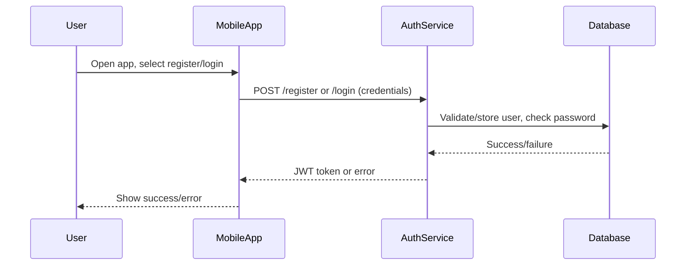

---

## 2. Marketplace Listing Creation & Purchase

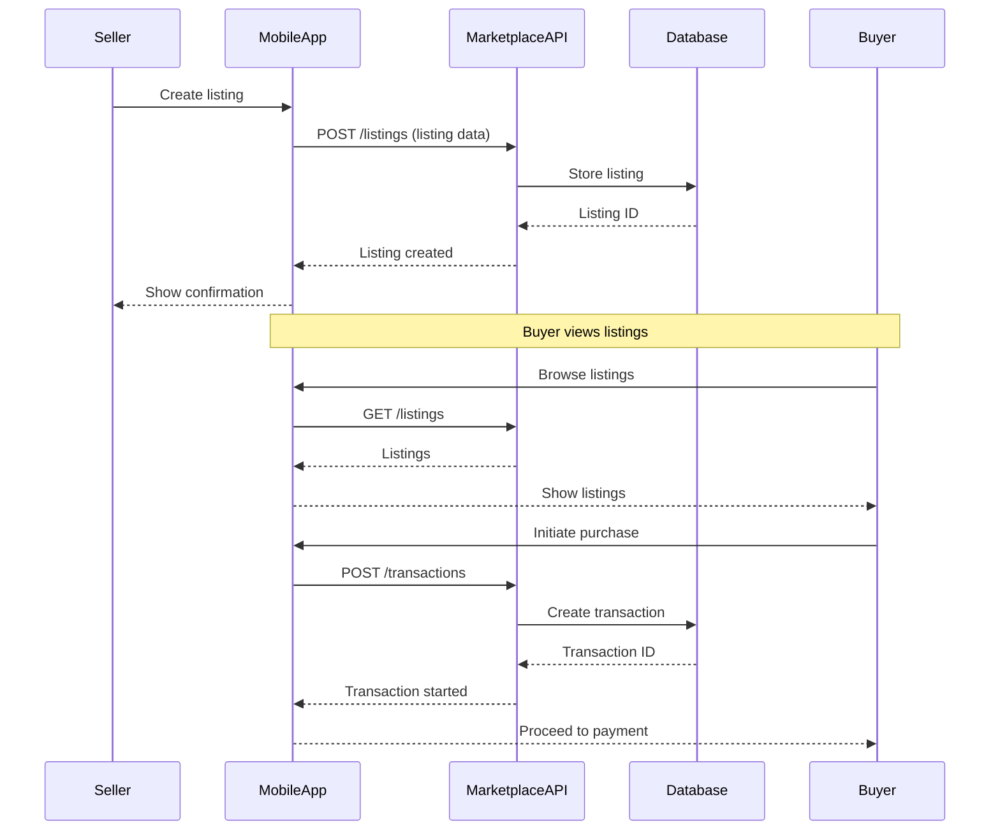

---

## 3. Payment Transaction

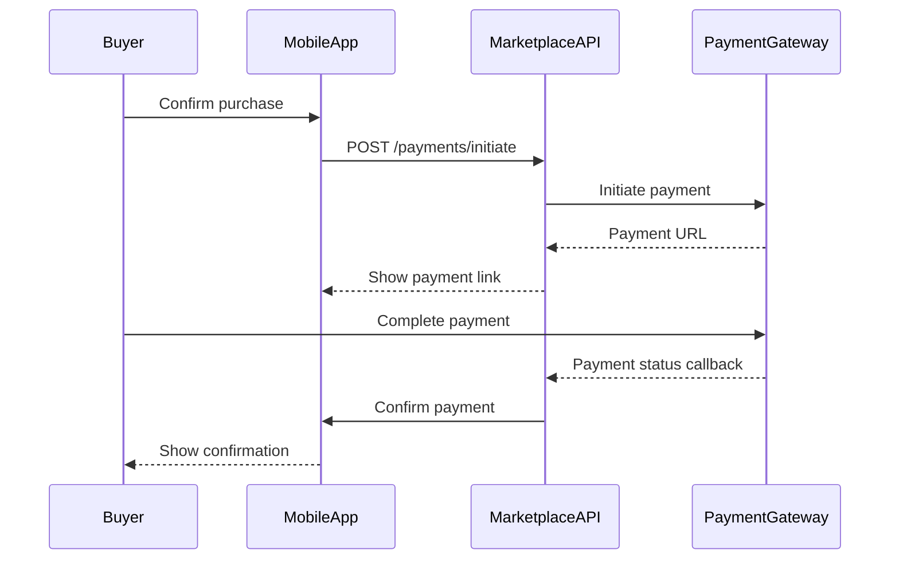

---

## 4. Crop Diagnostics Request & Result

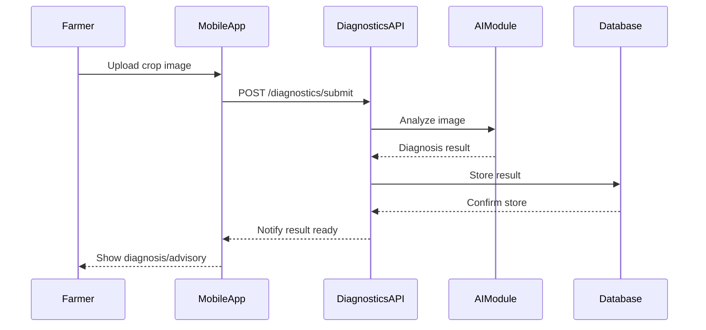

---

## 5. Notification Delivery

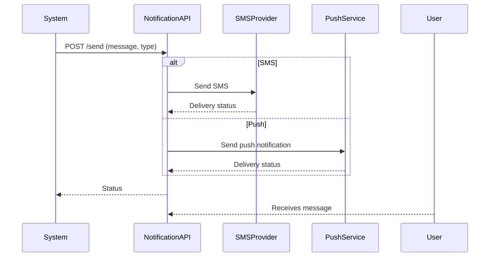

---

## 6. Admin Audit & Monitoring

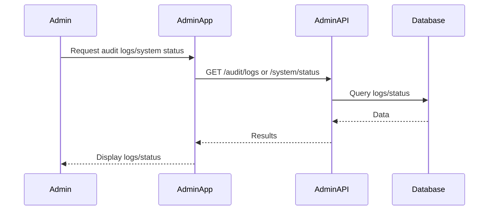

---

## 7. User Password Reset (via OTP)

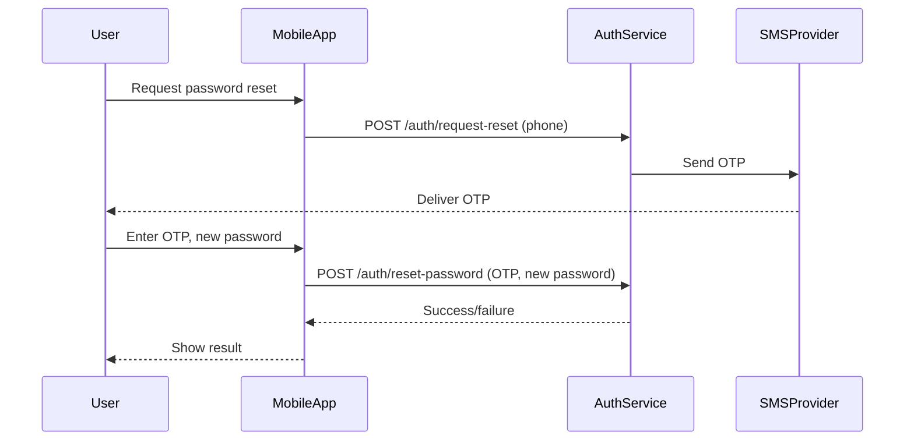

---

## 8. User Profile Update

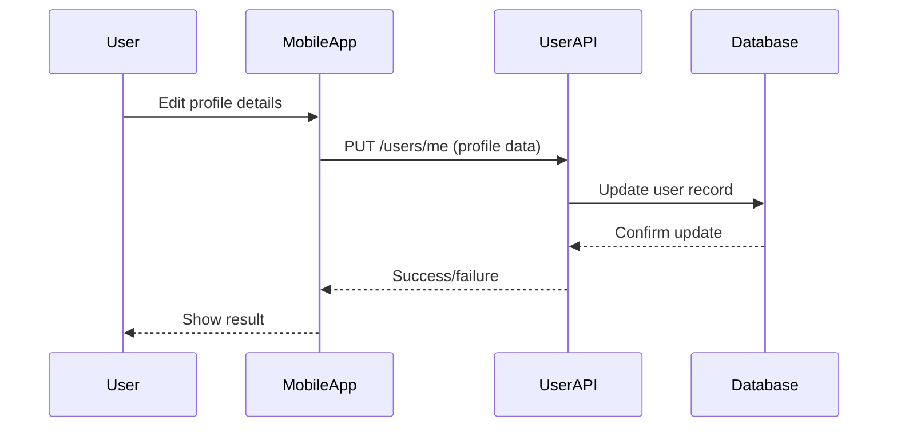

---

## 9. External API Integration (Weather Example)

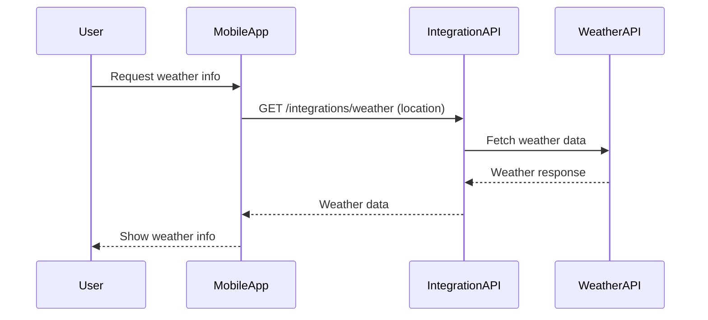

---

## 10. Data Backup and Restore

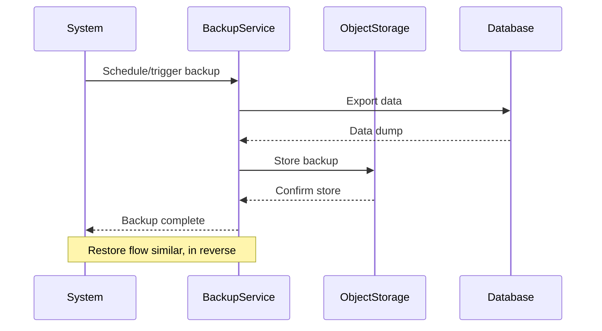

---

## 11. Mobile App: Offline Data Sync

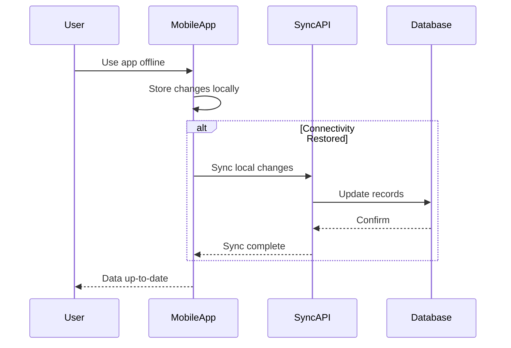

---

## 12. Admin: User Deletion or Suspension

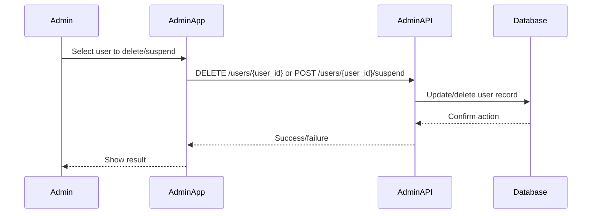

---

## 13. Marketplace Dispute Resolution

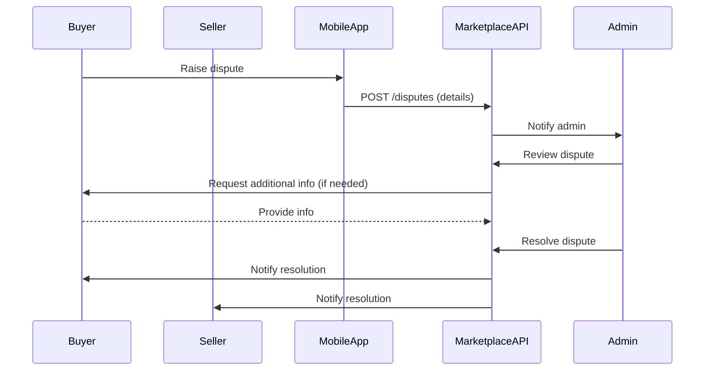

---

## 14. Notification: Multichannel Delivery (SMS, Email, Push)

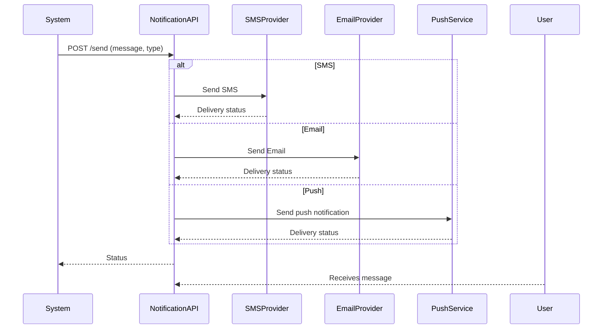

---

## 15. Audit Log Review and Export

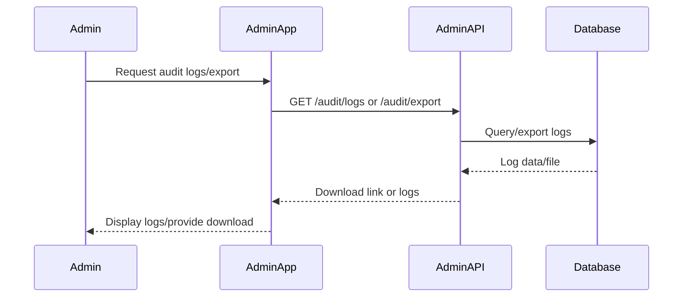

---

## 16. Role/Permission Change by Admin

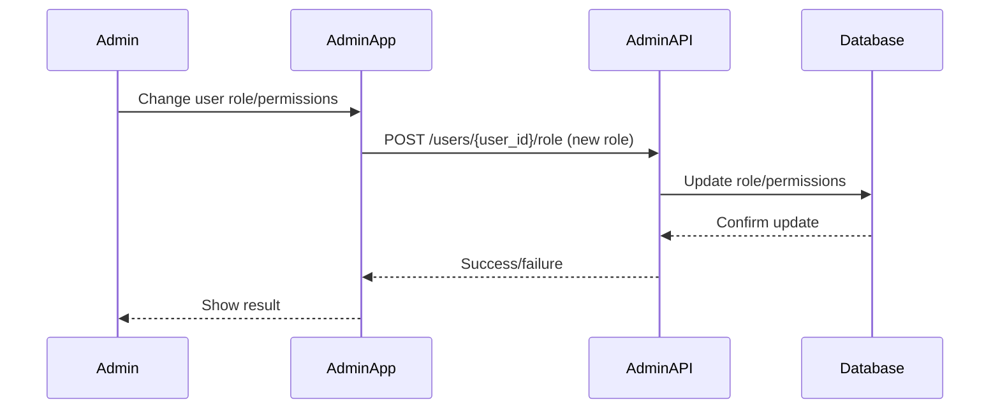

---

## 17. Payment Refund Process

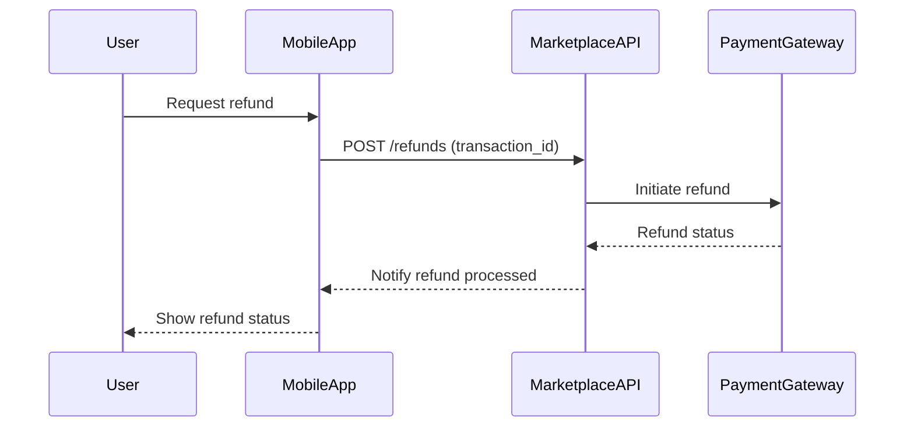

---

## 18. User Consent Management / Privacy Controls

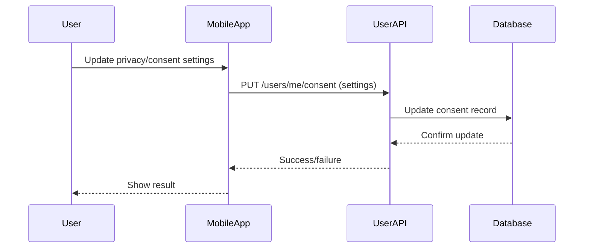
