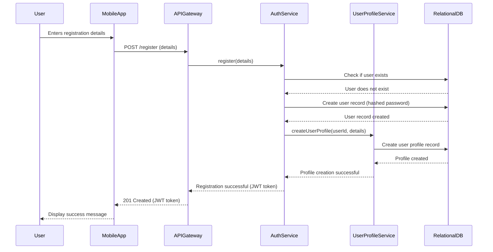

# Sequence Diagrams

## User Registration



## Crop Diagnostics

```mermaid
sequenceDiagram
    participant Farmer
    participant MobileApp
    participant APIGateway
    participant CropDiagnosticsService
    participant ObjectStorage
    participant AI_ML_Module
    participant ExpertAdvisoryService
    participant NotificationService

    Farmer->>MobileApp: Uploads crop image
    MobileApp->>APIGateway: POST /diagnostics/upload (image)
    APIGateway->>CropDiagnosticsService: uploadImage(image)
    CropDiagnosticsService->>ObjectStorage: Store image
    ObjectStorage-->>CropDiagnosticsService: Image URL
    CropDiagnosticsService->>AI_ML_Module: analyzeImage(imageURL)
    AI_ML_Module-->>CropDiagnosticsService: Analysis result (disease, confidence)
    alt Confidence is high
        CropDiagnosticsService->>APIGateway: Diagnosis result
        APIGateway-->>MobileApp: Display diagnosis to Farmer
    else Confidence is low
        CropDiagnosticsService->>ExpertAdvisoryService: createHelpTicket(imageURL, analysis)
        ExpertAdvisoryService-->>CropDiagnosticsService: Ticket created
        CropDiagnosticsService->>NotificationService: notifyExpert(ticketId)
        NotificationService-->>CropDiagnosticsService: Notification sent
        CropDiagnosticsService->>APIGateway: "Diagnosis sent for expert review"
        APIGateway-->>MobileApp: Display message to Farmer
    end