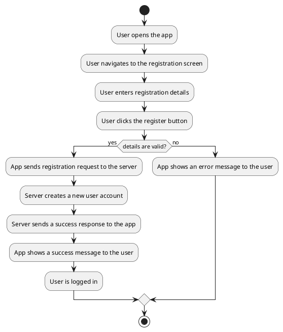

# Activity Diagram

## User Registration



## Crop Health Diagnostics

```plantuml
@startuml
start
:Farmer opens the app;
:Farmer navigates to the crop health diagnostics screen;
:Farmer uploads a crop image;
:App sends the image to the server;
:Server sends the image to the AI service;
:AI service analyzes the image;
:AI service returns the diagnosis to the server;
:Server sends the diagnosis to the app;
:App displays the diagnosis and recommendations to the farmer;
stop
@enduml
