# HLD: Backend Services

## Overview
The backend is a set of scalable microservices providing APIs, business logic, and integrations for all platform features. Each service is independently deployable, monitored, and secured.

## Microservices Architecture

```mermaid
flowchart TD
  AuthService[Authentication Service]
  RecEngine[Recommendation Engine]
  MarketService[Marketplace Service]
  WeatherService[Weather Service]
  ExpertSys[Expert Connect Service]
  ForumService[Community Forum Service]
  NotifService[Notification Service]
  ContentService[Content Management]
  DataService[Data Management]

  AuthService <--> UserDB[(User DB)]
  MarketService <--> PaymentGateway
  WeatherService <--> WeatherAPI
  NotifService <--> SMS/Email
  ContentService <--> ObjectStorage
  DataService <--> RelationalDB
  DataService <--> NoSQLDB
  AuthService <--> KMS[Key Management Service]
  AllServices[All Services] --> Logging[Centralized Logging]
  AllServices --> Metrics[Monitoring/Alerting]

  subgraph API Gateway
    AuthService
    RecEngine
    MarketService
    WeatherService
    ExpertSys
    ForumService
    NotifService
    ContentService
    DataService
  end
```


## Service Responsibilities
- **Authentication Service:** User registration, login, MFA, token management.
- **Recommendation Engine:** Personalized advice using ML models, integrates with weather, market, and user data.
- **Marketplace Service:** Listings, transactions, payment gateway integration, escrow management.
- **Weather Service:** Real-time and forecast data aggregation from external APIs.
- **Expert Connect Service:** Q&A, chat, webinar scheduling, expert directory.
- **Forum Service:** Community posts, replies, moderation, and rating.
- **Notification Service:** Push/in-app notifications, scheduling, SMS/email integration.
- **Content Management:** Educational content, government schemes, FAQs, media uploads.
- **Data Management:** User data, farm profiles, logs, analytics, backup triggers.

## Backend Services C4 Context Diagram

Below is a Mermaid-based C4 Context Diagram showing the main actors and external systems interacting with the backend services of Kheti Sahayak.

```mermaid
%% C4 Context Diagram for Backend Services
C4Context
    Person(user, "Farmer/User", "Uses the mobile/web app")
    Person(admin, "Admin", "Manages the platform")
    System(system, "Kheti Sahayak Backend", "Provides core business logic and APIs")
    System_Ext(payment, "Payment Gateway", "Handles transactions")
    System_Ext(weather, "Weather API", "Provides weather data")
    System_Ext(notification, "Notification Provider", "Sends SMS/Email/Push")
    System_Ext(gov, "Government Data", "Schemes and advisories")

    user -> system : API Requests (HTTPS)
    admin -> system : Admin APIs (RBAC)
    system -> payment : Payment Integration (TLS)
    system -> weather : Weather Data (API Key)
    system -> notification : Sends notifications
    system -> gov : Fetches government data
```

## Backend Services C4 Container Diagram

This diagram illustrates the main containers (microservices and supporting components) within the backend architecture.

```mermaid
%% C4 Container Diagram for Backend Services
C4Container
    System_Boundary(system, "Kheti Sahayak Backend") {
        Container(api, "API Gateway", "Kong/Nginx", "Routing, Security, Rate Limiting")
        Container(auth, "Auth Service", "Node.js/Java", "Authentication, Authorization")
        Container(market, "Marketplace Service", "Python/Node.js", "Listings, Transactions")
        Container(crop, "Crop Diagnostics Service", "Python/AI", "Image analysis, Disease detection")
        Container(user, "User Profile Service", "Node.js", "User data, Preferences")
        Container(data, "Data Storage", "PostgreSQL/MongoDB", "Structured and unstructured data")
        Container(notification, "Notification Service", "Node.js", "SMS, Email, Push")
    }
    Person(user, "Farmer/User")
    Person(admin, "Admin")

    user -> api : Uses APIs (HTTPS)
    api -> auth : Authenticates (JWT)
    api -> market : Marketplace APIs
    api -> crop : Crop Diagnostics APIs
    api -> user : User Profile APIs
    api -> notification : Sends notifications
    api -> data : Reads/Writes data
    admin -> api : Admin APIs
```

## Cross-Cutting Concerns
- **API Gateway:** Central entry point for authentication, rate limiting, request routing, and logging.
- **Monitoring:** Centralized logging, metrics collection, and alerting for all services.
- **Security:** JWT validation, RBAC, input validation, and secure service-to-service communication.
- **Scalability:** Auto-scaling and load balancing per service.
- **Resilience:** Circuit breakers, retries, and graceful degradation.

## DevOps & Deployment
- Containerized deployment (Docker/Kubernetes)
- CI/CD pipelines for automated testing and deployment
- Blue/green and canary releases for safe rollouts
