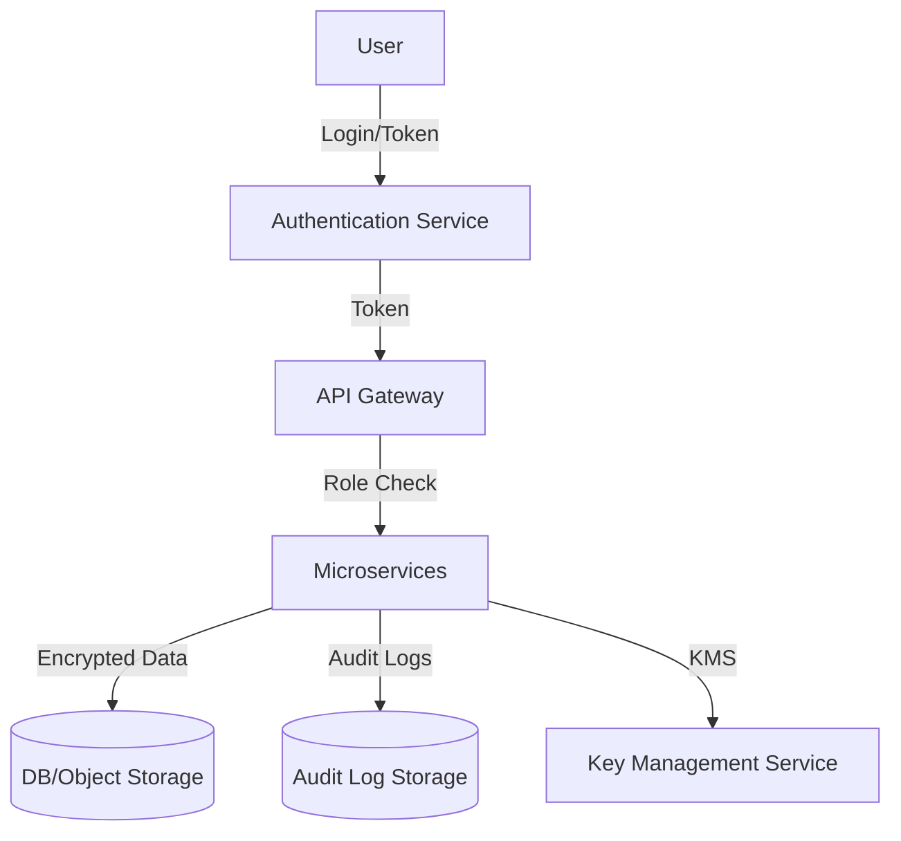

# HLD: Security & Privacy

## Overview
Security and privacy are foundational, with measures at every layer of the system. The platform is designed to proactively mitigate risks, protect user data, and comply with all relevant regulations.

## Security Model
- **Authentication:**
  - OAuth2/JWT for secure session management.
  - Multi-Factor Authentication (MFA) via OTP (SMS/email) or authenticator apps.
  - Password policies: Minimum length, complexity, expiry, and lockout after repeated failures.
- **Authorization:**
  - Role-based access control (RBAC) for farmers, experts, vendors, and admins.
  - Least privilege principle enforced throughout backend services.
  - Fine-grained API permissions for sensitive operations.
- **Encryption:**
  - TLS 1.2+ for all data in transit between clients and backend/services.
  - AES-256 or equivalent for data at rest in databases and object storage.
  - Encrypted backups and key management via cloud KMS (Key Management Service).
- **Auditing:**
  - Regular security reviews, vulnerability scans, and penetration testing.
  - Audit logs for all sensitive actions (logins, data exports, admin changes).
  - Tamper-evident log storage and periodic log review.

## Security Architecture C4 Context Diagram

Below is a Mermaid-based C4 Context Diagram illustrating the major actors and their interactions with the Kheti Sahayak platform from a security and privacy perspective.

```mermaid
%% C4 Context Diagram for Security & Privacy
C4Context
    Person(user, "Farmer/User", "Uses the Kheti Sahayak platform")
    Person(admin, "Admin", "Manages platform security and compliance")
    System(system, "Kheti Sahayak Platform", "Provides agricultural services and data")
    System_Ext(gov, "Government Data Sources", "Provides schemes and advisories")
    System_Ext(payment, "Payment Gateway", "Handles secure transactions")
    System_Ext(weather, "Weather API", "Provides weather data")
    System_Ext(notification, "SMS/Email Provider", "Sends notifications and OTPs")

    user -> system : Uses (OAuth2/JWT, RBAC)
    admin -> system : Administers (Audit, Incident Response)
    system -> gov : Fetches government data (Secure API)
    system -> payment : Processes payments (PCI DSS, TLS)
    system -> weather : Retrieves weather info (API Key, HTTPS)
    system -> notification : Sends notifications (TLS, Rate Limiting)
```

## Security Architecture C4 Container Diagram

This diagram shows the main containers (applications/services) within the Kheti Sahayak platform relevant to security and privacy.

```mermaid
%% C4 Container Diagram for Security & Privacy
C4Container
    System_Boundary(system, "Kheti Sahayak Platform") {
        Container(web, "Web/Mobile App", "Flutter/React Native", "User interface, session management")
        Container(auth, "Authentication Service", "Node.js/Java", "OAuth2, JWT, MFA")
        Container(api, "API Gateway", "Kong/Nginx", "Routing, Rate Limiting, Logging")
        Container(data, "Data Storage", "PostgreSQL/MongoDB", "Encrypted data at rest")
        Container(audit, "Audit & Monitoring", "ELK Stack", "Logs, alerts, incident response")
    }
    Person(user, "Farmer/User")
    Person(admin, "Admin")

    user -> web : Uses (TLS)
    web -> auth : Authenticates (OAuth2/JWT)
    web -> api : API Requests (HTTPS)
    api -> data : Reads/Writes data (Encrypted)
    api -> audit : Logs actions
    admin -> audit : Monitors security events
```

## Privacy Measures
- **User Consent:** Explicit opt-in for data collection, with clear privacy policy.
- **Data Minimization:** Collect only data necessary for service delivery.
- **Anonymization:** Use pseudonymization/anonymization for analytics and reporting.
- **User Controls:**
  - Self-service data export and account deletion.
  - Ability to manage notification and data sharing preferences.
- **Compliance:**
  - GDPR, Indian IT Act, and sector-specific guidelines.
  - Data processing agreements with all third-party vendors.
  - Data residency: Store sensitive data within required jurisdictions.

## Security Diagram


## Incident Response
- **Monitoring:**
  - Real-time monitoring of authentication, authorization, and data access events.
  - Automated alerts for suspicious activity (e.g., brute-force, privilege escalation, data exfiltration).
- **Response Plan:**
  - Documented incident response procedures.
  - Designated security response team.
  - Forensics and root cause analysis after incidents.
- **Breach Notification:**
  - Timely notification to affected users and authorities as per legal requirements.
  - Post-incident review and remediation.

## Additional Best Practices
- Secure software development lifecycle (SDLC) with code reviews and dependency checks.
- Regular employee security training and awareness.
- Third-party risk assessments for all integrations.
- Periodic review of access privileges and key rotation.
