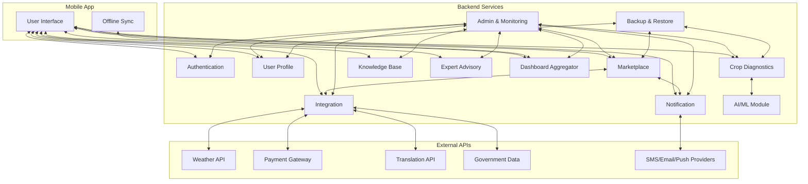

# Kheti Sahayak – System Design Document

## 1. Overview
Kheti Sahayak is a modular, scalable digital platform for Indian agriculture, supporting farmers, experts, and admins with marketplace, diagnostics, advisory, education, and integration services.

---

## 2. System Goals
- Empower farmers with digital tools for commerce, knowledge, and support
- Ensure security, privacy, and regulatory compliance
- Enable extensibility for new features and integrations
- Support high availability, scalability, and resilience

---

## 3. Architecture Summary
- **Microservices-based** backend with REST APIs
- **Mobile-first** frontend (Android/iOS)
- **Cloud-native** deployment (containerized, CI/CD, autoscaling)
- **External integrations:** Weather, payment, translation, government data
- **Security:** OAuth2/JWT, RBAC, TLS, auditing, encrypted storage

---

## 4. Core Services
| Service Name             | Responsibilities                                               |
|-------------------------|----------------------------------------------------------------|
| Authentication          | Registration, login, MFA, password reset, JWT auth             |
| User Profile            | Profile CRUD, privacy/consent, localization                    |
| Marketplace             | Listings, transactions, disputes, payment initiation           |
| Crop Diagnostics        | Image upload, AI/ML, advisory, history                         |
| Notification            | SMS, email, push, admin broadcast, history                     |
| Integration             | Weather, payment, translation, government data APIs            |
| Admin & Monitoring      | User mgmt, audit logs, system health, export                   |
| Backup & Restore        | Data backup/restore                                            |
| Knowledge Base          | Articles, guides, advisories, content delivery                 |
| Expert Advisory         | Query routing, expert-farmer Q&A, advice history               |
| Dashboard Aggregator    | (Optional) Personalized dashboard data                         |
| Mobile Sync/Offline     | Data sync, offline queue/conflict resolution                   |
| AI/ML Module            | ML inference for diagnostics                                   |

---

## 5. High-Level Architecture Diagram

---

## 6. Data Storage
- **Relational DB:** Users, listings, transactions, audit logs
- **NoSQL/Object Storage:** Images, backup files, large content
- **Cache:** For frequently accessed data (weather, dashboard)
- **Encrypted storage:** All sensitive data at rest

---

## 7. Security & Privacy
- OAuth2/JWT authentication, RBAC for all APIs
- TLS 1.2+ for all data in transit
- AES-256 for data at rest
- Auditing, tamper-evident logs
- Privacy controls and consent management
- Compliance: GDPR, Indian IT Act, PCI DSS (for payments)

---

## 8. DevOps & Deployment
- CI/CD pipeline with automated tests and deployment
- Containerized microservices (Docker/Kubernetes)
- Monitoring, centralized logging, alerting
- Daily backups, disaster recovery
- Blue/green or rolling deployments

---

## 9. Key Workflows (see sequence_diagrams.md)
- Registration/login, password reset, profile update
- Marketplace listing, purchase, dispute, refund
- Crop diagnostics, expert advisory, education content
- Notification delivery, dashboard aggregation
- Admin actions, audit log review, backup/restore

---

## 10. Extensibility & Roadmap
- Modular services for easy feature addition
- API-first approach for 3rd-party integrations
- Support for additional languages, crops, and regions
- AI/ML expansion for diagnostics, recommendations

---

## 11. References
- [API Specifications](./)
- [Sequence Diagrams](./sequence_diagrams.md)
- [User Stories & Acceptance Criteria](./user_stories_acceptance_criteria.md)
- [NFRs](../nfr/)

---

For further details, refer to the linked HLD, API, and NFR documents.
